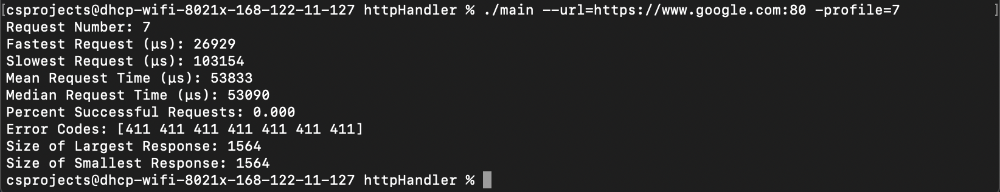

# Systems Assignment

## What is it?
Uses sockets to directly handle an HTTP POST Request, written in Golang.

## Building and Running
- To build: `make build`
- To run: `make run`
    - Makes a request to [General Assignment Website](http://sweet-worker.tintheturtle.workers.dev:80/links)
- To clean: `make clean`

## Using Executable
- Run `make build`
- Run `./main` with the following options below:
```
    - help       bool
    	Help information on how to use this 
    - profile   int
    	Number of requests to be made (default 1)
    - url       string
    	URL to request to test (must include port number)
```
- Example use with executable:
```
./main --url=http://sweet-worker.tintheturtle.workers.dev:80/links --profile=7
```

## Comparison

- [Cloudflare](http://sweet-worker.tintheturtle.workers.dev:80/links)


- [Youtube](https://www.youtube.com:80)


- [Google](https://www.google.com:80)


Compared to other websites, Cloudflare has a faster response time using this tool. Each website listed above were tested multiple times with this tool and while each test may have differed slightly, the response of Cloudflare has been the best. 